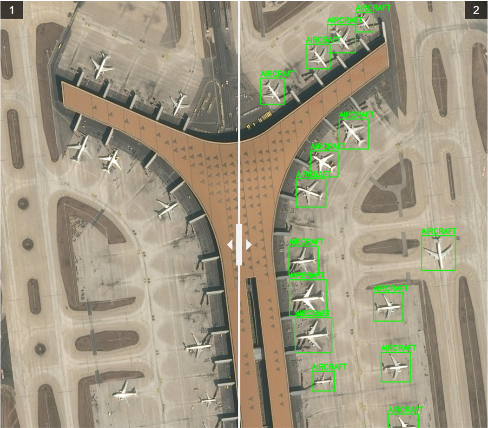

# Aircraft Intelligence Hub

**Aircraft Intelligence Hub**: Elevating Satellite Imagery and Airport Analysis with Advanced AI Algorithm & Data Analysis

#

The Aircraft Intelligence Hub, powered by advanced algorithms, streamlines satellite image analysis for enhanced precision and rapid insights. Leveraging automation, it offers valuable intelligence on airport dynamics, aircraft flow, and economic factors, contributing to informed decision-making.

  

## Features 🚀

- **User-Friendly Interface:** Aircraft Detector uses a simple and aesthetic user interface for inputs and detections output.

- **Multiple File Options:** The program is compatible with all common image formats and videos. 

- **Aircraft Detection Algorithm:** Air Detector generates detections on all aircrafts within the image/video and highlights detections.

- **Image Comparison:** Air Detector presents an image comparison tool to highlight detections

- **Download on Click:** Easily download detection results after analysis

- **Airport Analysis Graphs:** Easily produce 4 unique airport analysis graphs

## Limitations & Possible Improvements ⚠️

- **Computing Limitation:** The Aircraft Detector was trained on personal equipment thus training was limited to 100 epochs. More training time would lead to better accuracy

- **Dataset Limitation:** The Aircraft Detector was trained on ~2500 aircraft detections annotated by hand by Ori Bloch. More data would improve accuracy and detect more aircraft-type detection. The data is from Airbus open source db, as one may find in the "images_db_info" page.

- **Efficiency Improvements:** Video analysis currently does not use Kalman-Filter for faster object tracking

- **Added Modules**  Future enhancements may include modules for ship detection or truck counting

## Manual Guide 📖

1. **Import all relevant directories:**
   - Import all relevant dependencies from requirements.txt

2. **Run Streamlit:**
   - Use the console and write: "streamlit run front.py"

3. **Upload Files:**
   - Choose Image / Video
   - Upload the file you wish to analyze
   - Press Analyze

4. **Comparison Image**
   - Use the bar to see before and after images.

5. **Download Detection**
   - Press the Download Button to download the detections
   
6. **Airport Analysis**
   - Select airport, start and end date for analysis
   
7. **Review Graphs**
   - Review 4 unique graphs for specific airport and time selected 

8. **Developer Changes**
   - See main.py for instructions on developer changes 

# Main Dependencies

Make sure you have the following dependencies installed before running the project:

1. **OpenCV - Computer Vision**
   - Documentation: [CV2 Documentation](https://docs.opencv.org/4.x/)

2. **YOLOv8 - Object Detection Algorithm**
   - Documentation: [YOLOv8 Documentation](https://docs.ultralytics.com/)

3. **streamlit - Frontend Environment**
   - Documentation: [Streamlit Documentation](https://docs.streamlit.io/)
   
4. **SQlite - Database query**
   - Documentation: [SQlite Documentation](https://www.sqlite.org/docs.html)

5. **see requirements.txt**

## Author 🧑‍💻

**Ori Bloch**
- Space Business Development Lead
- Electrical & Computer Engineering Student
- Algorithm Engineer

- 
- 
#

  

